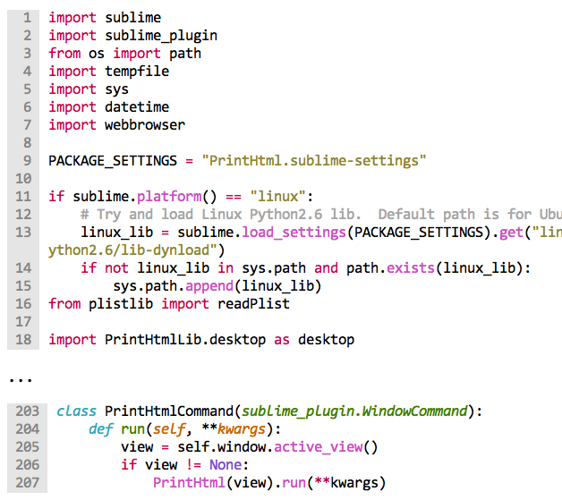

# ExportHtml

[![Build][github-ci-image]][github-ci-link]
[![Package Control][pc-image]][pc-link]
[![License][license-image]][license-link]

This is a fork of [Andrew Gibson](https://github.com/agibsonsw)'s [PrintHtml](https://github.com/agibsonsw/PrintHtml) plugin.  This plugin allows the exporting of a document in Sublime Text to a HTML file or to BBCode.  It duplicates Sublime's theme colors and font styles.

# Features

- Export to HTML using any `tmTheme` or `sublime-color-scheme` for syntax highlighting.
- Can handle any language supported by ST2.
- Supports bold and italic theme font styles as well.
- Configurable output.
- Format suitable for copying and pasting in emails.
- 2 included `sublime-color-scheme` files for color and grayscale printing (but any can be used).
- Export only selections (multi-select supported).
- Export and show highlights (multi-select supported).
- Toggle gutter on/off in browser view.
- Automatically open browser print dialog (optional).
- Enable/disable configurable word wrapping.
- Configurable toolbar to appear in the generated webpage.

# Documentation

https://codebyzach.github.io/sublime_export_html/

# Credits

- [Andrew Gibson](https://github.com/agibsonsw): Original idea and base code for converting Sublime view to HTML and allowing me to build off it to make ExportHtml.
- Print-Color and Print-Grayscale `sublime-color-scheme` files were derived from Monokai Bright.

# License

ExportHtml is released under the MIT license.

Copyright (c) 2012 - 2020 Isaac Muse <isaacmuse@gmail.com>

Permission is hereby granted, free of charge, to any person obtaining a copy of this software and associated documentation files (the "Software"), to deal in the Software without restriction, including without limitation the rights to use, copy, modify, merge, publish, distribute, sublicense, and/or sell copies of the Software, and to permit persons to whom the Software is furnished to do so, subject to the following conditions:

The above copyright notice and this permission notice shall be included in all copies or substantial portions of the Software.

This work is licensed under the [The MIT License](LICENSE).

[github-ci-image]: https://github.com/CodeByZach/sublime_export_html/workflows/build/badge.svg?branch=master&event=push
[github-ci-link]: https://github.com/CodeByZach/sublime_export_html/actions?query=workflow%3Abuild+branch%3Amaster
[pc-image]: https://img.shields.io/packagecontrol/dt/ExportHtml.svg?labelColor=333333&logo=sublime%20text
[pc-link]: https://packagecontrol.io/packages/ExportHtml
[license-image]: https://img.shields.io/badge/license-MIT-blue.svg?labelColor=333333
[license-link]: LICENSE
