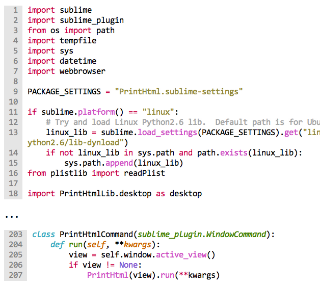

[![Unix Build Status][travis-image]][travis-link]
[![Package Control Downloads][pc-image]][pc-link]
![License][license-image]
# ExportHtml

This is a fork of [Andrew Gibson](https://github.com/agibsonsw)'s [PrintHtml](https://github.com/agibsonsw/PrintHtml) plugin.  This plugin allows the exporting of a document in Sublime Text to a HTML file or to BBCode.  It duplicates Sublime's theme colors and font styles.

# Features

- Export to HTML using any tmTheme for syntax highlighting.
- Can handle any language supported by ST2.
- Supports bold and italic theme font styles as well.
- Configurable output.
- Format suitable for copying and pasting in emails.
- 2 included tmTheme files for color and grayscale printing (but any can be used).
- Export only selections (multi-select supported).
- Export and show highlights (multi-select supported).
- Toggle gutter on/off in browser view.
- Automatically open browser print dialog (optional).
- Enable/disable configurable word wrapping.
- Configurable toolbar to appear in the generated webpage.

# Documentation

https://eatbreathecode.github.io/sublime_export_html/

# Credits

- [Andrew Gibson](https://github.com/agibsonsw): Original idea and base code for converting Sublime view to HTML and allowing me to build off it to make ExportHtml.
- Print-Color and Print-Grayscale tmThemes were derived from Monokai Bright.

# License

This work is licensed under the [The MIT License](LICENSE).

[travis-image]: https://img.shields.io/travis/facelessuser/ExportHtml/master.svg
[travis-link]: https://travis-ci.org/facelessuser/ExportHtml
[pc-image]: https://img.shields.io/packagecontrol/dt/ExportHtml.svg?logo=sublime%20text&logoColor=cccccc
[pc-link]: https://packagecontrol.io/packages/ExportHtml
[license-image]: https://img.shields.io/badge/license-MIT-blue.svg